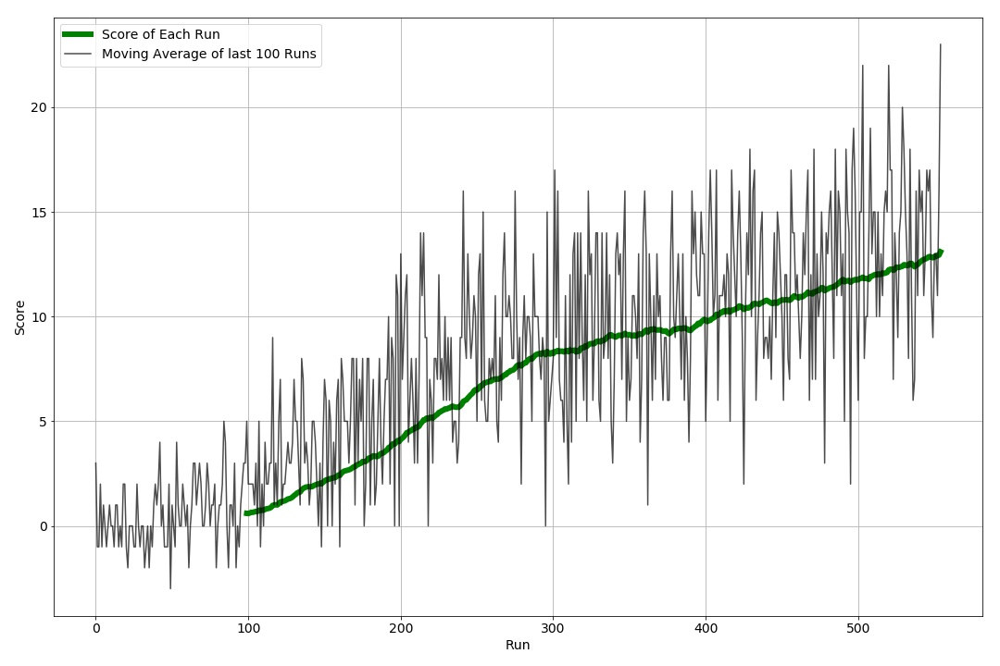

# Report

I have created Double DQN algorithm for the banana catching game. The Algorithm
resides inside the `dqn/` directory.

**Double DQN**
I developed **DDQN** as DDQN has a better performance then DQN. Here I have
two layer NN as Q-Value Estimator. Hidden layers are composed of
input: state  
HL1 : 32 nodes leakyReLU  
HL2 : 8 nodes linearRelu
output: action

I implemented **Experience Replay** similarly to the DQN paper. Here we trained
DDQN by mini-batch from relay buffer.

Our agent selects next action by looking epsilon greedy. With the probability
 epsilon, the agent selects randomly from action space.
The value of epsilon is set 0.999, and decrease gradually with time until 0.001.

## Result
The result is included. At 555. episode I had an average score of 13.09 and it
stopped training.

[Model](./model.pt)
